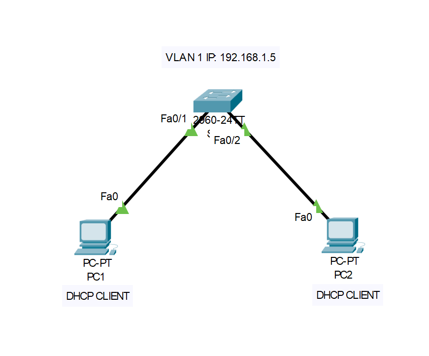

# Lab 2: SSH Configuration

## Description
This lab aims to verify remote connection to the switch using the SSH protocol in a LAN network.

## Objectives
1. Change the hostname of the switch to SW1.
2. Create users with different privilege levels.
3. Configure SSH on the switch.
4. Configure console line and VTY lines.
5. Set up a DHCP server on the switch.
6. Configure VLAN 1 with an IP address.
7. Verify IP address assignment from the DHCP server to two PCs.
8. Test remote SSH connection to the switch.

## Requirements
- Cisco ws-c2960-24tc-s
- 2 PCs (PC1, PC2)
- Cisco Packet Tracer or another network simulation tool

## Files
- **configurations/**: Contains the configuration file for the switch.
- **documentation/**: Contains the network diagram and detailed instructions.

## Instructions
1. Open Cisco Packet Tracer.
2. Load the configuration files from the `configurations/` directory.
3. Follow the steps described in `documentation/lab_instructions.md`.

## Network Diagram

## Contact
If you have any questions or suggestions, you can contact me via email: tomaszwoznicki74@gmail.com.
