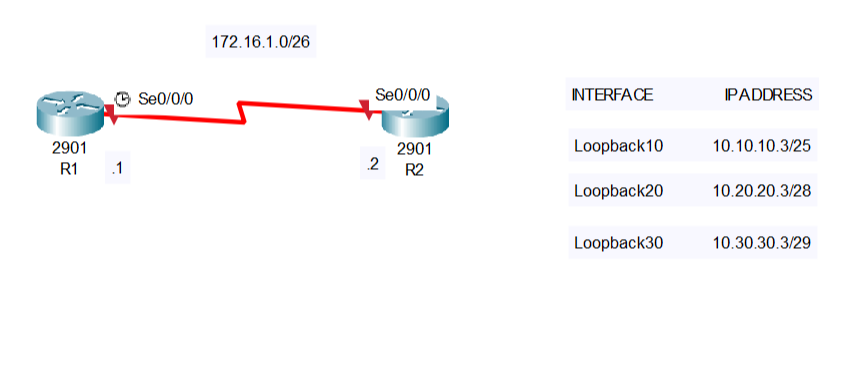

# Lab 3 : Configure, Verify, and Troubleshoot IPv4 Addresses

## Lab Objective
The objective of this lab exercise is for you to learn and understand how to create and troubleshoot IPv4 addresses on Cisco routers.

## Lab Purpose
Configuring IPv4 addressing is one of your most fundamental tasks as a Cisco engineer. In the exam, you may also be asked to troubleshoot IPv4 addressing that has already been configured but incorrectly, so you need to know which show commands to use.

## Requirements
- Cisco Packet Tracer or another network sumulation tool.
- 2 routers with HWIC-2T card, providing 2 serial ports.

## Lab Tasks 
1. Configure the hostnames on routers R1 and R2 as illustraded in the Network Diagram.
2. Configure R1 S0/0/0, which is a DCE, to provide a clock rate of 768 Kbps to R2 (uless you are using GNS3). Configure the IP addresses on the Serial interfaces of R1 and R2 as illustrated in the Network Diagram. Configure the Loopback interfaces specified in the diagram on R1 and R2.
3. Use the correct show commands to check:
- The summary of all configured IP addresses.
- The status of the interface(up/down or administratively down).
- The subnet mask applied to the intreface.

## Files
- **configurations/**: Contains the configuration file for the device
- **documentation/**: Contains the network diagram and detailed instructions.

## Instructions
1. Open Cisco Packet Tracer.
2. Load the configuration files from the `configurations/` directory.
3. Follow the steps described in `documetation/lab_instructions.md`.

## Network Diagram

## Contact 
If you have any questions or suggestions, you can contact me via email: tomaszwoznicki74@gmail.com
