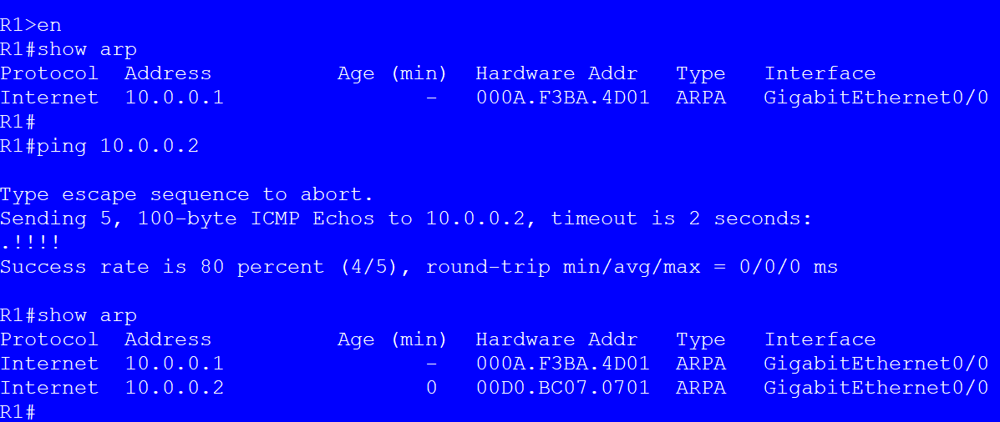

# Instructions for Lab

## Task 1 
1. Change the hostname of the router to R1:
```plaintext
Router>enable
Router>config t
Router(config)#hostname R1
R1(config)#end
```
2. Change the hostname of the router to R2:
```plaintext
Router>enable
Router>config t
Router(config)#hostname R2
R2(config)#end
```
2. Change the hostname of the router to R3:
```plaintext
Router>enable
Router>config t
Router(config)#hostname R3
R2(config)#end
```
## Task 2 
1. Assign IP Address to Gig0/0 interface and add static route on router R1
```plaintext
R1>en
R1>conf t
R1(config)#int G0/0
R1(config-if)#ip add 10.0.0.1 255.255.255.252
R1(config-if)#no shut
R1(config-if)#exit
R1(config)#ip route 0.0.0.0 0.0.0.0 10.0.0.2
```
2. Assign IP Addresses to Gig0/0 and Gig0/1 interfaces on router R2
```plaintext
R2>en
R2(config)#int G0/0
R2(config-if)#ip add 10.0.0.2 255.255.255.252
R2(config-if)#no shut
R2(config-if)#exit
R2(config)#int G0/1
R2(config-if)#ip add 192.168.1.1 255.255.255.0
R2(config-if)#no shut
```
3. Assign IP Address to Gig0/0 interface on router R3
```plaintext
R3>en
R3>conf t
R3(config)#int G0/0
R3(config-if)#ip add 192.168.1.2 255.255.255.0
R3(config-if)#no shut
R3(config-if)#exit
R3(config)#ip route 0.0.0.0 0.0.0.0 192.168.1.1
```
## Task 3
1. show arp command
