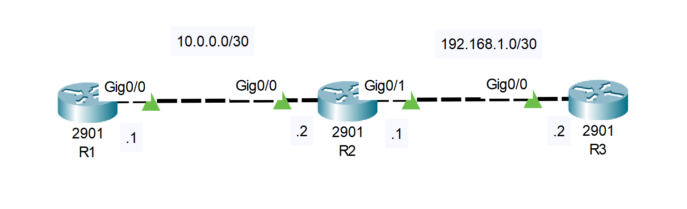

## Lab 4 : ARP and Proxy ARP

## Lab Objective:
The objective of this lab exercise is for you to learn and understand how ARP and Proxy ARP is used by the router in order to enxapsulate the packet before it is sent to a neighbor device.

## Lab Purpose
You must understand how ARP works in order to pass the CCNA exam. You could well be faced with an ARP-related issue to troubleshoot in the exam or int the real world.

## Requirements
- Cisco Packet Tracer or another network simulation tool.
- 3 routers.

## Lab Tasks 
1. Configure the hostnames on routers R1, R2, and R3 as illustrated in the network diagram.
2. Configure the IP addresses on the Ethernet interfaces of R1, R2, and R3 as illustraded in the network diagram. Add static routes so that R1 can ping the host address on R3 and R3 can return the ping. Then check the ARP cache on R1. A default route for all traffic to leave via the Ethernet interface will do.
3.Use the correct show commands to check:
- The ARP cache on R1. What are the times for the learned addresses? Which will not timeout and how can you tell?
- What is the entry for R3 and why is it the same as the R2 Ethernet interface?
- What does the "-" in the ARP tabe mean?

## Files
- **configurations/**: Contains the configuration file for the device
- **documentation/**: Contains the network diagram and detailed instructions.

## Instructions
1. Open Cisco Packet Tracer.
2. Load the configuration files from the `configurations/` directory.
3. Follow the steps described in `documetation/lab_instructions.md`.

## Network Diagram

## Contact 
If you have any questions or suggestions, you can contact me via email: tomaszwoznicki74@gmail.com